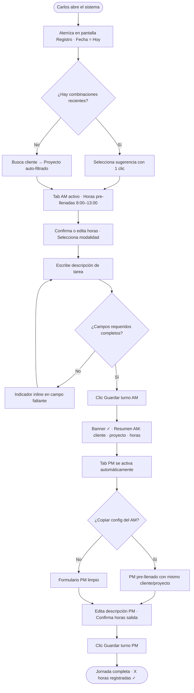
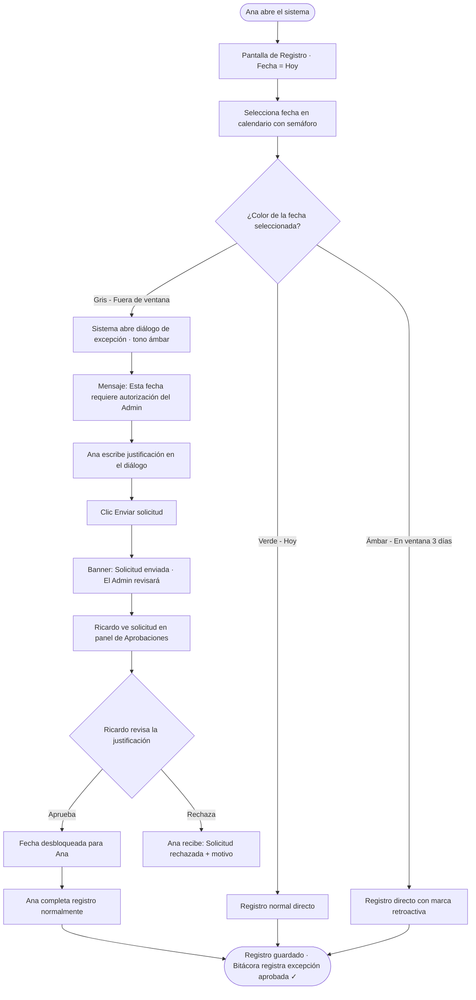
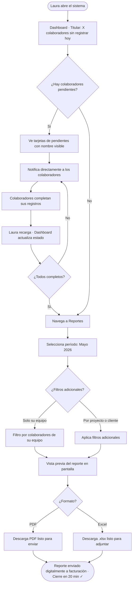
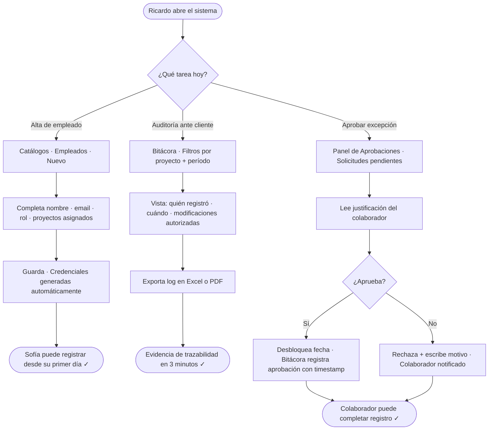

# UX Design Specification KPG Timesheet Platform

**Author:** Jonathan
**Date:** 2026-05-12

---

<!-- UX design content will be appended sequentially through collaborative workflow steps -->

## Resumen Ejecutivo

### Visión del Proyecto

KPG Timesheet Platform reemplaza el registro de horas en Excel compartido — sin auditoría, con retraso y propenso a errores — por una plataforma web centralizada donde cada hora queda firmada, inmutable y disponible para facturación con un clic. Para una firma de consultoría que factura por horas trabajadas, la exactitud del timesheet es igual a la exactitud del ingreso. La plataforma es de uso exclusivo en escritorio (Blazor WebAssembly), opera en red interna corporativa y atiende a 30 colaboradores con 4 roles diferenciados.

### Usuarios Objetivo

| Persona | Necesidad principal | Dolor actual |
|---------|--------------------|-----------------------------|
| **Carlos** — Empleado (consultor senior) | Registrar sus horas rápido y sin errores | Reconstruye la semana de memoria cada viernes; sus datos no son exactos |
| **Ana** — Empleado (caso borde: viaje) | Que el sistema la ayude cuando no pudo registrar a tiempo | El Excel no tiene reglas claras sobre retroactividad |
| **Laura** — Supervisora | Saber quién registró y quién no, generar reporte en minutos | 2–4 horas consolidando Excel en cada cierre de mes |
| **Ricardo** — Admin | Control total y trazabilidad ante auditorías de clientes | Limpia errores ajenos sin herramientas adecuadas |

### Retos Clave de Diseño

1. **Velocidad vs. completitud del formulario:** El formulario captura cliente, proyecto, modalidad, descripción, lugar, turno y horas. Sin defaults inteligentes o jerarquía visual clara, Carlos tardará 5 minutos en lugar de los 2 minutos objetivo.
2. **Comunicación de la ventana de tiempo:** Ana debe entender en el momento exacto qué fechas puede seleccionar, cuáles requieren excepción y cómo solicitarla — sin documentación ni llamadas a Ricardo.
3. **Dashboard accionable:** Laura no necesita un gráfico bonito; necesita ver en 3 segundos quién falta y actuar directamente desde ahí.
4. **Visibilidad según rol:** 4 roles ven mundos distintos. El diseño debe sentirse completo para cada uno, no como una versión recortada.
5. **Primera carga de Blazor WASM:** Sin feedback visual honesto durante la carga inicial (más lenta que apps web tradicionales), los usuarios percibirán el sistema como roto.

### Oportunidades de Diseño

1. **Defaults inteligentes por patrón de uso:** Pre-llenar cliente y proyecto según historial reciente del usuario puede reducir el tiempo de entrada en un 60%.
2. **Calendario con semáforo visual:** Fechas disponibles, retroactivas y fuera de ventana diferenciadas visualmente con acción directa de excepción — elimina la ambigüedad completamente.
3. **Headline del dashboard = el número que importa:** Para Laura, ese número es cuántos del equipo no han registrado hoy. Grande, visible y con acción directa.
4. **Flujo de excepción como diálogo de ayuda:** Cuando Ana toca una fecha bloqueada, el sistema la guía: "Esta fecha requiere autorización. ¿Quieres solicitarla?" — no la penaliza.
5. **Confirmación de guardado con resumen:** Después de guardar, mostrar un resumen del registro creado cierra el loop mental y genera confianza en el sistema.

---

## Experiencia Central del Usuario

### La Experiencia Definitoria

La acción que más se repite — y que define el valor de la plataforma — es el **registro diario de horas** (AM y/o PM) con cliente, proyecto y descripción. Esa interacción ocurre ~30 veces por día entre los 30 colaboradores. Si no es rápida, clara y confiable, los usuarios regresan al Excel y el proyecto fracasa su objetivo central.

La acción crítica de no fallar es el **formulario de registro**: lento, confuso o con errores poco claros equivale a adopción fallida.

### Estrategia de Plataforma

- **Tipo:** Web SPA (Blazor WebAssembly), uso exclusivo en escritorio
- **Navegadores:** Chrome y Edge (prioridad primaria), Firefox (secundario)
- **Entrada:** Mouse + teclado; navegación completa por teclado requerida (NFR19)
- **Red:** Interna corporativa, sin exposición pública, sin requerimiento offline
- **Exclusiones V1:** Sin acceso móvil, sin modo offline

### Interacciones que Deben Sentirse sin Fricción

| Interacción | Criterio de éxito |
|-------------|-------------------|
| Seleccionar fecha | Pre-seleccionada en "hoy"; cambio en máximo 1 click |
| Elegir cliente/proyecto | Combinaciones recientes disponibles de inmediato |
| Guardar el formulario | Un botón, confirmación visible en < 2 segundos |
| Ver estado del equipo | Respuesta a "¿quién falta hoy?" visible sin scroll al abrir dashboard |

### Momentos Críticos de Éxito

1. **Primer guardado exitoso del empleado** — la confirmación post-guardado decide si el colaborador confía en el sistema o llama a soporte para verificar.
2. **Primer reporte mensual del supervisor** — el momento "aha": generar el PDF en 3 clics sin imprimir ni consolidar nada manualmente.
3. **Empleado toca una fecha bloqueada** — si el sistema guía hacia la excepción con calma y claridad, gana confianza; si bloquea con un error rojo, la pierde.
4. **Admin exporta bitácora ante auditoría de cliente** — en menos de 3 minutos demuestra trazabilidad completa; ese momento justifica toda la plataforma.

### Principios de Experiencia

1. **Velocidad primero.** El registro diario en menos de 2 minutos no es una aspiración — es un requisito de diseño. Toda pantalla, campo y flujo se evalúa contra ese criterio.
2. **Guiar, no bloquear.** Cuando el sistema detecta un límite (ventana de tiempo, campo vacío, permiso insuficiente), ofrece el siguiente paso — nunca solo un mensaje de error.
3. **Una pantalla, un propósito.** Cada rol entra y ve exactamente lo que necesita para su tarea principal. Sin exploración, sin menús escondidos — solo tareas para completar.
4. **Confianza a través de confirmación.** Cada acción que afecta datos (guardar, eliminar, aprobar) retorna feedback visible que cierra el loop mental del usuario sin dejar dudas.

---

## Respuesta Emocional Deseada

### Objetivos Emocionales Primarios

La emoción central que la plataforma debe generar es **confianza**: confianza en que los datos están guardados correctamente, en que el sistema es justo, y en que está ayudando al usuario a hacer su trabajo — no vigilándolo.

| Persona | Emoción durante el uso | Emoción al completar la tarea |
|---------|------------------------|-------------------------------|
| **Carlos** (Empleado) | Fluidez — "esto va rápido" | Alivio — "ya no voy a reconstruir esto de memoria el viernes" |
| **Ana** (Empleado - borde) | Esperanza — "el sistema me está ayudando" | Seguridad — "quedó registrado y fue justo" |
| **Laura** (Supervisora) | Control — "sé exactamente cómo está mi equipo" | Orgullo — "cerré el mes en 20 minutos" |
| **Ricardo** (Admin) | Confianza — "tengo visibilidad total" | Poder — "puedo responder cualquier auditoría en minutos" |

### Jornada Emocional

- **Primera visita:** Sorpresa positiva — "es más simple de lo que esperaba" (no debe parecer una herramienta ERP pesada)
- **Durante el registro diario:** Fluidez — sin fricción, sin pensar, el sistema anticipa lo que el usuario necesita
- **Al guardar:** Alivio y certeza — la confirmación cierra el loop mental sin dejar dudas
- **Cuando algo está restringido:** Claridad calmada — el sistema explica y ofrece el siguiente paso, no penaliza
- **Al volver al día siguiente:** Confianza consolidada — "ya sé cómo funciona esto, confío en él"

### Micro-Emociones

| Par emocional | Meta | Cómo lograrlo |
|---------------|------|---------------|
| Confianza vs. Escepticismo | Confianza | Confirmación post-guardado con resumen visible del registro creado |
| Fluidez vs. Frustración | Fluidez | Defaults inteligentes, mínimo de clicks para el caso habitual |
| Esperanza vs. Ansiedad | Esperanza | Flujo de excepción como diálogo de ayuda, no como muro de error |
| Control vs. Vigilancia | Control | Dashboard orientado a la tarea del supervisor, no a la fiscalización del empleado |
| Alivio vs. Resignación | Alivio | Reporte mensual en 3 clics, sin pasos manuales adicionales |

### Implicaciones de Diseño

- **Confianza →** Confirmación post-guardado con resumen inequívoco: _"Lunes 12/05 · Turno AM · 8:00–13:00 · Cliente X / Proyecto Y — guardado ✓"_
- **Fluidez →** Fecha pre-seleccionada en hoy; sugerencia de cliente/proyecto basada en historial reciente
- **Esperanza →** Cuando el empleado toca una fecha fuera de ventana: _"Esta fecha requiere autorización. ¿Solicitar ahora?"_ — un botón, no un párrafo de error rojo
- **Control →** El número más importante del dashboard (registros pendientes del equipo hoy) es el titular de la página, no un detalle secundario
- **Vigilancia evitada →** Los mensajes de restricción dicen _"necesitas autorización para esto"_, nunca _"acceso denegado"_

### Principios de Diseño Emocional

1. **La ansiedad del "¿se guardó bien?" es el fracaso más grave.** Si un colaborador cierra la ventana con dudas sobre si su registro quedó guardado, el sistema falló su función más básica.
2. **Restricción ≠ castigo.** Cada límite del sistema (ventana de tiempo, permisos de rol) se comunica como ayuda hacia el siguiente paso posible, no como rechazo.
3. **La herramienta ayuda, no vigila.** El lenguaje, los mensajes y la jerarquía visual de cada rol refuerzan que el sistema es un facilitador, no un mecanismo de control sobre el empleado.

---

## Análisis de Patrones UX e Inspiración

### Análisis de Productos Inspiradores

**Toggl Track — estándar de registro de tiempo**

- Fast entry: mínimo de campos para iniciar; el historial pre-llena automáticamente
- Sugerencias por historial: últimas combinaciones cliente/proyecto disponibles con un clic
- Confirmación inline: sin modales bloqueantes; la certeza es visual en la misma vista
- Edición en línea: modificar un registro pasado no abre un formulario nuevo

Limitación aplicable: el timer en vivo no encaja con el modelo de turnos AM/PM de KPG.

**Linear — herramienta interna empresarial bien diseñada**

- Keyboard-first by design: cada acción tiene atajo de teclado; creación de ítem en < 5 segundos
- Jerarquía visual sin ruido: máximo dos o tres niveles de información visibles simultáneamente
- Estado como primer ciudadano: el status de cada ítem es el elemento más visible, no un campo lateral
- Vistas pre-configuradas por rol: cada usuario entra y ve su contexto de trabajo, sin filtros que configurar

**Google Calendar — modelo mental de fecha/tiempo**

- La fecha es contexto visual, no un campo de texto: selección en calendario donde se ve la semana completa
- Hoy siempre está destacado: navegación temporal por semana, no por día aislado
- Bloques de tiempo como objetos visuales: mañana y tarde como espacios — no como pares de campos inicio/fin

### Patrones Transferibles

**Navegación:**
- Navegación lateral fija con sección activa destacada (Linear) — cada rol ve solo sus secciones relevantes
- Mini-calendar lateral para selección de fecha con semáforo de disponibilidad (Google Calendar)

**Interacción en el formulario:**
- Lista de últimas combinaciones cliente/proyecto usadas para pre-llenar el formulario con un clic (Toggl)
- Navegación completa por teclado: `Tab` avanza entre campos, `Enter` guarda (Linear) — cumple NFR19
- Turnos AM/PM como bloques visuales seleccionables, no como campos separados de hora inicio/hora fin (Google Calendar)

**Feedback y confirmación:**
- Confirmación post-guardado inline en la misma vista, sin modal bloqueante (Toggl)
- Mensajes de restricción con acción sugerida integrada — no solo descripción del problema (Linear)

### Anti-Patrones a Evitar

| Anti-patrón | Riesgo para KPG |
|-------------|-----------------|
| Formulario de 10+ campos visibles simultáneamente (Jira, SAP) | El colaborador abandona antes de llegar a la descripción |
| "Acceso denegado" sin contexto ni siguiente paso | El empleado siente que el sistema lo castiga, no lo ayuda |
| Dashboard con múltiples gráficos de igual peso visual | El supervisor no sabe dónde mirar; la información crítica se pierde |
| Modal de confirmación para cada guardado | Interrumpe el flujo en la acción más frecuente del sistema |
| Dropdowns de muchos ítems sin búsqueda integrada | Con múltiples clientes y proyectos, seleccionar tarda más que escribir |
| Paginación de tablas en lugar de scroll continuo | Rompe el flujo de revisión de registros históricos |

### Estrategia de Inspiración de Diseño

**Adoptar directamente:**
- Sistema de sugerencias por historial (Toggl) → pre-llenar cliente/proyecto según uso reciente
- Navegación keyboard-first (Linear) → cumple NFR19 y acelera el caso habitual del empleado
- Mini-calendar lateral con contexto visual (Google Calendar) → selector de fecha con semáforo de ventana de tiempo

**Adaptar:**
- Fast entry de Toggl → en KPG el turno AM/PM reemplaza el timer; pre-seleccionar AM en horario de mañana, PM en horario de tarde
- Vistas por rol de Linear → en KPG son 4 roles fijos con vistas pre-configuradas a la tarea principal de cada uno

**Evitar completamente:**
- Formularios masivos de enterprise legacy
- Dashboards de BI con múltiples métricas de igual jerarquía visual
- Modales bloqueantes para acciones frecuentes

---

## Sistema de Diseño

### Elección del Sistema de Diseño

**Sistema seleccionado: MudBlazor** — Material Design nativo para Blazor WebAssembly.

### Justificación de la Selección

| Factor | Decisión |
|--------|----------|
| Costo | Gratuito y open source — costo adicional $0 |
| Timeline | Componentes listos para usar desde el primer día; productividad inmediata del equipo |
| Plataforma | Librería nativa de Blazor — sin capas de interoperabilidad JS |
| Accesibilidad | Soporte ARIA y navegación por teclado integrados — cumple NFR19 sin trabajo extra |
| Familiaridad visual | Material Design conocido por usuarios de Google Workspace |
| Componentes críticos disponibles | `MudDatePicker`, `MudForm`, `MudDataGrid`, `MudDrawer`, `MudChip`, `MudAlert` |

Opciones descartadas: Radzen (menor calidad visual), custom + Tailwind (incompatible con timeline de 7 semanas).

### Enfoque de Implementación

- Instalar MudBlazor como dependencia NuGet en el proyecto Blazor WASM
- Configurar `MudThemeProvider` con paleta de colores corporativa KPG al inicio del proyecto (Semana 2)
- Usar componentes MudBlazor como base para todas las vistas; extender solo cuando el componente nativo sea insuficiente
- Definir tema personalizado una sola vez — todos los componentes lo heredan automáticamente

### Estrategia de Personalización

**Paleta de colores:**
- Color primario: azul corporativo KPG (a confirmar con la organización; si no existe guía de marca, usar azul empresarial neutro `#1565C0`)
- Color secundario: gris neutro para elementos de apoyo
- Color de acento/éxito: verde para confirmaciones de guardado
- Color de advertencia: amarillo/ámbar para fechas retroactivas en ventana
- Color de error/bloqueo: rojo para validaciones fallidas y fechas fuera de ventana

**Tipografía:** Roboto (incluida en Material Design) — sans-serif legible en pantallas de escritorio.

**Densidad:** Compact density en tablas y listas; default density en formularios — maximiza información visible sin sacrificar legibilidad.

**Componentes a extender (custom sobre MudBlazor):**
- Selector de fecha con semáforo de ventana de tiempo (wrapper sobre `MudDatePicker`)
- Tarjeta de estado de colaborador para el dashboard del supervisor
- Banner de confirmación post-guardado con resumen del registro

---

## Fundación Visual

### Sistema de Color

Paleta extraída directamente del logo corporativo KPG (wordmark navy + abanico K multicolor):

| Token semántico | Color | Hex | Uso principal |
|----------------|-------|-----|---------------|
| **Primary** | Navy KPG | `#0D3B5E` | Navegación, botones principales, encabezados |
| **Secondary** | Azul cielo KPG | `#5BB8D4` | Acentos, links, estados de información |
| **Warning** | Ámbar KPG | `#FFD300` | Fechas retroactivas en ventana, alertas no críticas |
| **Accent** | Naranja KPG | `#F57C20` | Badges de pendiente, notificaciones |
| **Success** | Verde Material | `#2E7D32` | Confirmación de guardado, estado "registrado" |
| **Error** | Rojo Material | `#C62828` | Validaciones fallidas, fechas fuera de ventana |
| **Surface** | Blanco | `#FFFFFF` | Fondos de cards y formularios |
| **Background** | Gris claro | `#F5F5F5` | Fondo general de la aplicación |
| **On-Primary** | Blanco | `#FFFFFF` | Texto e íconos sobre navy |

**Semáforo del selector de fecha (componente custom sobre MudDatePicker):**

- Verde `#2E7D32` — Hoy y días disponibles para registro
- Ámbar `#FFD300` — Días dentro de la ventana retroactiva de 3 días hábiles
- Gris `#9E9E9E` — Fuera de ventana; clic abre flujo de solicitud de excepción

### Sistema Tipográfico

El wordmark "kpg" usa una sans-serif redondeada moderna. Se adopta **Poppins** para títulos y **Roboto** para cuerpo — combinación disponible como Google Font sin costo adicional, compatible con MudBlazor.

| Nivel | Fuente | Tamaño | Uso |
|-------|--------|--------|-----|
| Page title | Poppins SemiBold | 24px | Títulos de sección principal |
| Card title | Poppins Medium | 20px | Encabezados de cards y widgets |
| Body | Roboto Regular | 16px | Contenido principal, labels de formulario |
| Secondary | Roboto Regular | 14px | Texto de apoyo, metadatos |
| Caption | Roboto Regular | 12px | Timestamps, notas de pie |

### Espaciado y Layout

| Elemento | Valor | Razón |
|----------|-------|-------|
| Base unit | 8px | Estándar MudBlazor |
| Navegación lateral | 240px fija | Suficiente para etiquetas de sección de los 4 roles |
| Top app bar | 64px | Estándar Material Design |
| Content padding | 24px | Respira sin desperdiciar espacio en desktop |
| Max content width | 1200px | Centrado en pantallas anchas; evita líneas muy largas |
| Densidad en formularios | Default (comfortable) | Campos con espacio suficiente — reduce errores de captura |
| Densidad en tablas | Compact | Más filas visibles en dashboard y reportes |
| Card padding | 16px | Estándar Material Design |

### Consideraciones de Accesibilidad

- Navy `#0D3B5E` sobre blanco: ratio de contraste **9.4:1** ✅ (supera WCAG AA y AAA)
- Verde success `#2E7D32` sobre blanco: ratio **5.1:1** ✅
- Azul cielo `#5BB8D4` sobre blanco: ratio **3.0:1** ⚠️ — usar solo en elementos gráficos o texto grande (≥ 18px); nunca en texto pequeño
- Todo texto de cuerpo en `#212121` sobre blanco: ratio **16:1** ✅
- Focus indicators visibles en todos los campos interactivos (requerido por NFR19)
- El color nunca actúa como único indicador de estado — siempre acompañado de ícono o texto descriptivo

---

## Dirección de Diseño

### Direcciones Exploradas

Se generaron tres direcciones de diseño completas (archivo: `ux-design-directions.html`):

| Dirección | Concepto | Característica principal |
|-----------|----------|--------------------------|
| **A — Navy Sidebar** | Enterprise corporativo | Sidebar con color navy KPG; acento ámbar en ítem activo; máxima jerarquía visual |
| **B — Sidebar Claro** | Moderno minimalista | Sidebar blanco con borde; navy solo en acciones activas; contenido como protagonista |
| **C — Sidebar Icónico** | Compacto avanzado | Sidebar de 64px con íconos; maximiza espacio de contenido; mayor curva de aprendizaje |

Todos incluyen: formulario AM/PM con sugerencias por historial, selector de fecha con semáforo visual, dashboard de estado del equipo y flujos especiales (diálogo de excepción, login).

### Dirección Elegida

**Dirección A — Navy Sidebar Corporativo**, con elementos del calendario semáforo de la Dirección B integrados como componente independiente.

### Justificación de la Elección

- **Confiabilidad ante todo:** KPG Timesheet es la fuente de verdad financiera de la empresa. El sidebar navy transmite seriedad e inmutabilidad — exactamente la emoción que necesita una herramienta de facturación.
- **Identidad KPG visible:** El navy del sidebar y el ámbar como indicador activo reflejan directamente los colores del logo corporativo en cada pantalla.
- **Adopción sin fricción:** Los 30 colaboradores en su mayoría conocen herramientas enterprise. El sidebar con etiquetas reduce la curva de aprendizaje — importante para la adopción en la primera semana.
- **Jerarquía clara por rol:** Cada rol verá solo las secciones que le corresponden en la navegación lateral — sin ítems grises ni secciones "bloqueadas" visibles.

### Enfoque de Implementación

- Shell: `MudLayout` + `MudDrawer` (variante Persistent, ancho 240px) en desktop
- Top bar: `MudAppBar` con título de sección + badge de estado contextual
- Ítem activo: `MudNavLink` con `ActiveClass` que aplica `border-left: 3px solid #FFD300`
- Tema MudBlazor: `Primary = #0D3B5E`, `PrimaryDarken = #082A45`, `Secondary = #5BB8D4`
- Componente custom: `KpgDatePicker` — wrapper sobre `MudDatePicker` con lógica de semáforo de ventana

---

## Flujos de Jornada de Usuario

### J1 — Empleado: Registro Diario (Camino Exitoso)

**Contexto:** Carlos, 5:30pm del martes. Registro del día con sugerencias por historial.



**Optimización:** Con sugerencias recientes + copiar AM, el camino feliz se reduce a 6 pasos. El sistema recuerda por el usuario.

---

### J2 — Empleado: Registro Tardío Fuera de Ventana

**Contexto:** Ana regresa de viaje y necesita registrar una fecha pasada.



**Optimización:** La excepción se activa desde el calendario — Ana nunca ve un error rojo. El diálogo usa ámbar KPG (advertencia, no bloqueo) y siempre ofrece el siguiente paso.

---

### J3 — Supervisor: Cierre Mensual y Reporte de Facturación

**Contexto:** Laura, último día hábil del mes. Del dashboard al PDF en 20 minutos.



**Optimización:** El dashboard es el punto de entrada — Laura ve los pendientes antes de buscarlos. El reporte se genera en 3 clics desde que llega a la sección.

---

### J4 — Admin: Gestión de Catálogos y Auditoría

**Contexto:** Ricardo. Alta de empleado, auditoría y aprobación de excepción en el mismo día.



### Patrones de Jornada

| Patrón | Descripción | Jornadas |
|--------|-------------|----------|
| **Sugerencias recientes** | Última combinación usada disponible en 1 clic | J1 y cualquier formulario con entidades |
| **Confirmación inline** | Banner de éxito en la misma vista, nunca modal bloqueante | J1, J2, J3, J4 |
| **Estado como punto de entrada** | El sistema muestra el problema antes de que el usuario lo busque | J3 (pendientes en dashboard) |
| **Excepción contextual** | El flujo de excepción se activa desde donde surge el problema | J2 (desde el calendario) |
| **Acciones de admin centralizadas** | Panel central de Aprobaciones, Bitácora y Catálogos accesibles directamente | J4 |

### Principios de Optimización de Flujos

1. **Camino feliz primero:** El caso más frecuente (registro con sugerencias recientes) tiene el mínimo de pasos posible.
2. **Sin callejones sin salida:** Todo estado de restricción ofrece el siguiente paso accionable — nunca solo un mensaje de error.
3. **Progreso visible:** En jornadas multi-paso, el usuario siempre sabe cuánto falta y qué viene.
4. **Recuperación sin penalidad:** Los errores de validación no borran el trabajo — solo señalan qué corregir inline.

---

## Estrategia de Componentes

### Componentes MudBlazor (Uso Directo)

| Componente | Uso en KPG |
|------------|------------|
| `MudLayout` + `MudDrawer` + `MudAppBar` | Shell de la aplicación |
| `MudNavMenu` + `MudNavLink` | Navegación lateral por rol |
| `MudTextField`, `MudTimePicker` | Campos de entrada/salida y texto |
| `MudAutocomplete` | Búsqueda de cliente y proyecto |
| `MudChipSet` + `MudChip` | Selector de modalidad |
| `MudForm` | Wrapper de formulario con validación integrada |
| `MudTabs` + `MudTab` | Estructura AM/PM del formulario |
| `MudDataGrid` | Tabla de reportes, historial y bitácora |
| `MudDialog` | Base para diálogos modales |
| `MudAlert` | Mensajes de advertencia inline menores |
| `MudCard` | Contenedor de secciones de contenido |

**Nota:** MudBlazor no incluye gráficas nativas. Se integrará **ApexCharts for Blazor** (open source) para la distribución de horas en el dashboard.

### Componentes Custom KPG

#### KpgDatePicker

**Propósito:** Comunicar visualmente qué fechas están disponibles, retroactivas o bloqueadas.

- **Estados de fecha:** Verde (hoy/disponible) · Ámbar (ventana retroactiva) · Gris (fuera de ventana → abre diálogo de excepción)
- **Inputs:** `WindowDays` (desde parámetro del sistema), `DisabledDates`
- **Outputs:** `OnDateSelected(date, DateAvailability)`, `OnExceptionRequested(date)`
- **Base:** Wrapper sobre `MudDatePicker`
- **Accesibilidad:** `aria-label` con disponibilidad en cada celda; navegación por teclado con flechas

#### KpgShiftForm

**Propósito:** Contener la experiencia central del registro AM/PM — el componente más crítico de la aplicación.

- **Estados:** `Empty` · `InProgress` · `Saved` (muestra resumen compacto + ícono ✓)
- **Estructura:** `MudTabs` (AM/PM) + `KpgRecentSuggestions` + campos + acciones
- **Acción interna:** "Copiar config del AM" disponible en tab PM cuando AM ya está guardado
- **Accesibilidad:** Focus automático en campo Entrada al activar un tab; Tab avanza en orden lógico; Enter en botón Guardar

#### KpgRecentSuggestions

**Propósito:** Eliminar el 60% del tiempo de búsqueda mostrando las últimas combinaciones cliente/proyecto usadas.

- **Contenido:** Últimas 3–5 combinaciones usadas por el usuario autenticado
- **Acción:** Clic emite `OnSuggestionSelected(clientId, projectId)` → formulario se pre-llena
- **Fuente:** `GET /api/registros/recientes?userId=X&top=5`
- **Accesibilidad:** `role="button"` en cada chip; navegable por teclado

#### KpgSaveConfirmationBanner

**Propósito:** Dar certeza inequívoca de que el registro quedó guardado — cierra el loop de ansiedad.

- **Contenido:** `[Turno] [Fecha] · [Hora entrada]–[Hora salida] · [Cliente] / [Proyecto] ✓`
- **Comportamiento:** Aparece post-guardado; auto-oculta a los 8 segundos o al siguiente acción del usuario
- **Variantes:** Success (verde) · Warning-retroactive (ámbar)
- **Accesibilidad:** `role="status"` + `aria-live="polite"`

#### KpgTeamStatusCard

**Propósito:** Mostrar el estado de cada colaborador en el dashboard del supervisor en menos de 3 segundos.

- **Contenido:** Avatar iniciales + nombre + horas del día + badge de estado
- **Estados:** `Complete` (borde verde) · `Partial` (borde azul) · `Pending` (borde naranja/rojo)
- **Acción:** Clic en tarjeta pendiente expande detalle de últimos registros del colaborador

#### KpgExceptionDialog

**Propósito:** Guiar al colaborador hacia la solución cuando no puede registrar — tono de ayuda, no de error.

- **Header:** Fondo ámbar `#FFF8E1`, ícono de reloj, título + fecha seleccionada
- **Body:** Explicación + textarea de justificación (requerida)
- **Acciones:** `[Cancelar]` secundario + `[Enviar solicitud]` naranja KPG `#F57C20`
- **Validación:** Botón "Enviar" desactivado si justificación está vacía
- **Post-envío:** Cierra diálogo + muestra `KpgSaveConfirmationBanner` con confirmación de envío
- **Base:** Wrapper sobre `MudDialog`

#### KpgStatCard

**Propósito:** Mostrar el número más importante de cada sección del dashboard con jerarquía visual clara.

- **Contenido:** Valor (Poppins grande) + etiqueta + sub-etiqueta opcional con color semántico
- **Variantes:** `Default` (navy) · `Alert` (rojo — pendientes) · `Success` (verde)

### Arquitectura de Componentes

```
KpgTheme (Primary=#0D3B5E, Secondary=#5BB8D4, Warning=#FFD300)
├── Componentes MudBlazor (uso directo)
└── Componentes custom KPG
    ├── KpgDatePicker      ← extiende MudDatePicker
    ├── KpgShiftForm       ← usa MudTabs + MudForm + MudTimePicker
    ├── KpgRecentSuggestions ← usa MudChip
    ├── KpgSaveConfirmationBanner ← usa MudAlert
    ├── KpgTeamStatusCard  ← usa MudCard + MudChip
    ├── KpgExceptionDialog ← usa MudDialog
    └── KpgStatCard        ← componente standalone
```

### Roadmap de Implementación

| Fase | Semana | Componentes | Justificación |
|------|--------|-------------|---------------|
| **1 — Críticos J1** | 2–3 | `KpgShiftForm`, `KpgDatePicker`, `KpgSaveConfirmationBanner` | Definen la experiencia central del empleado |
| **2 — Flujos clave** | 3–4 | `KpgRecentSuggestions`, `KpgExceptionDialog`, `KpgTeamStatusCard` | Completan J1, habilitan J2 y J3 |
| **3 — Dashboard** | 4–5 | `KpgStatCard`, integración ApexCharts | Habilitan dashboard de supervisor y gerente |

---

## Patrones de Consistencia UX

### Jerarquía de Botones

| Nivel | Estilo | Uso |
|-------|--------|-----|
| **Primario** | Fondo navy `#0D3B5E`, texto blanco | Una sola acción principal por pantalla: Guardar, Generar reporte, Enviar solicitud |
| **Secundario** | Borde navy, texto navy, fondo blanco | Acciones alternativas: Cancelar, Volver, Exportar secundario |
| **Destructivo** | Fondo rojo `#C62828`, texto blanco | Eliminar, Rechazar — siempre precedido de confirmación explícita |
| **Ghost/Texto** | Solo texto, color sky `#5BB8D4` | Acciones terciarias: "Copiar config del AM", "Ver detalle", links |

**Regla:** Solo un botón primario por vista o card. Nunca dos botones primarios compitiendo.

### Patrones de Feedback

**Éxito:** `KpgSaveConfirmationBanner` inline — verde, ícono ✓, resumen de la acción. Nunca un modal de confirmación de éxito.

**Error de validación:** Indicador rojo bajo el campo específico + mensaje en 1 línea. Activado en `onBlur` — nunca mientras el usuario escribe. Botón Guardar deshabilitado hasta que el formulario sea válido.

**Advertencia (retroactividad):** Banner ámbar `#FFF8E1` inline — tono informativo, no alarmista.

**Error del sistema:** `MudAlert` severidad Error al tope de la vista. Texto: "Ocurrió un error al guardar. Tus datos no se perdieron. [Reintentar]". El formulario conserva todos los valores.

### Patrones de Formulario

**Orden de campos en el formulario de registro:**
1. Fecha (contexto) → 2. Turno AM/PM (estructura) → 3. Horas entrada/salida → 4. Cliente → 5. Proyecto → 6. Modalidad (chips) → 7. Descripción → 8. Lugar (opcional)

**Dropdowns:** `MudAutocomplete` con búsqueda integrada para cliente y proyecto — nunca `<select>` nativo con más de 10 ítems.

**Validación:** `onBlur` en todos los campos. Doble validación: client-side activa el botón, server-side confirma antes de retornar éxito.

**Guardado:** Un solo botón primario por turno. Sin "Guardar borrador" en V1.

### Patrones de Navegación

- El ítem activo tiene `border-left: 3px solid #FFD300` — indicador visual de posición en la app
- Los ítems inaccesibles para el rol **no aparecen** — nunca se muestran deshabilitados
- Sidebar fijo a 240px en desktop — no colapsa
- Sin breadcrumb en V1 — estructura de navegación plana

### Estados de Carga

**Primera carga Blazor WASM:** Pantalla de loading con logo KPG + barra de progreso + texto "Cargando KPG Timesheet..." — honesto sobre la demora inicial.

**Carga de datos:** `MudProgressCircular` centrado en el área de contenido; skeleton rows en tablas (3–5 filas placeholder mientras carga el DataGrid).

**Guardado en progreso:** Botón muestra spinner inline + texto "Guardando..." y se deshabilita durante la llamada al API.

### Estados Vacíos

| Vista | Mensaje |
|-------|---------|
| Mis Registros (vacío) | "Aún no tienes registros. Empieza registrando las horas de hoy." + botón de acción |
| Reportes (sin resultados) | "No se encontraron registros con los filtros seleccionados. Ajusta el período o los filtros." |
| Bitácora (vacía) | "No hay eventos en el período seleccionado." |

### Patrones de Tablas

- Densidad Compact en todos los `MudDataGrid`
- Ordenamiento habilitado en columnas de fecha, nombre y horas
- Paginación: 25 filas por defecto con selector (25 / 50 / 100)
- Exportación: botones "Exportar Excel" y "Exportar PDF" en el header de cada tabla
- Fechas: formato `dd/MM/yyyy` · Horas: formato `HH:mm` (24 horas)

### Patrones de Modales

**Cuándo usar modal:** Solo para `KpgExceptionDialog` y confirmaciones de eliminación.

**Cuándo NO usar modal:** Mensajes de éxito, alertas informativas, confirmaciones de guardado.

**Confirmación de eliminación:** Modal simple con mensaje específico ("¿Eliminar el registro del mar 12/05 · Turno AM?") — nunca genérico. Botones: `[Cancelar]` secundario + `[Eliminar]` destructivo.

---

## Diseño Responsive y Accesibilidad

### Estrategia Responsive

KPG Timesheet V1 es **desktop-first y desktop-only**. El acceso móvil está explícitamente fuera del alcance de V1.

**Anchos de pantalla soportados:**

| Pantalla | Resolución | Comportamiento |
|----------|-----------|----------------|
| Laptop estándar | 1280px – 1439px | Layout principal; sidebar 240px fijo + contenido fluido |
| Laptop/monitor mediano | 1440px – 1919px | Contenido centrado a max 1200px con padding lateral |
| Monitor ancho | 1920px+ | Contenido centrado; espacios laterales en gris `#F5F5F5` |

**Mínimo soportado:** 1280px. Por debajo de este ancho la experiencia puede degradarse — comunicar a usuarios antes del go-live.

**Breakpoints MudBlazor relevantes:**
- `Breakpoint.MdAndUp` (≥ 960px) — layout principal activo
- `Breakpoint.LgAndUp` (≥ 1280px) — columnas adicionales en dashboard
- `Breakpoint.XlAndUp` (≥ 1920px) — centrado máximo

**DataGrid en 1280px:** Columnas menos prioritarias se ocultan con `HideSmallScreen`. Las columnas críticas (fecha, horas, cliente) siempre visibles.

### Estrategia de Accesibilidad

**Nivel objetivo: WCAG 2.1 AA** — estándar de industria, alineado con NFR19 y NFR20.

**Contraste de colores (validado):**

| Combinación | Ratio | Estado |
|-------------|-------|--------|
| Navy `#0D3B5E` sobre blanco | 9.4:1 | ✅ AAA |
| Verde `#2E7D32` sobre blanco | 5.1:1 | ✅ AA |
| Texto `#212121` sobre blanco | 16:1 | ✅ AAA |
| Sky `#5BB8D4` sobre blanco | 3.0:1 | ⚠️ Solo texto ≥ 18px o íconos |

**Navegación por teclado (NFR19):**
- `Tab` / `Shift+Tab` — avance y retroceso entre campos en orden visual
- `Enter` / `Space` — activa botones y chips
- `Flechas` — navegan opciones en dropdowns y chips de modalidad
- `Escape` — cierra modales y dropdowns abiertos
- Focus visible en todos los elementos — no se suprime sin reemplazo

**Gestión de focus en componentes custom:**
- `KpgShiftForm`: al activar tab AM/PM, focus va al campo "Entrada"
- `KpgExceptionDialog`: al abrirse, focus al textarea; al cerrarse, regresa a la fecha que lo activó
- `KpgDatePicker`: navegación entre días del calendario con teclas de flecha

**ARIA en componentes custom:**

| Componente | Atributos requeridos |
|------------|---------------------|
| `KpgDatePicker` | `aria-label` con disponibilidad en cada celda |
| `KpgSaveConfirmationBanner` | `role="status"` + `aria-live="polite"` |
| `KpgExceptionDialog` | `role="dialog"` + `aria-labelledby` + `aria-describedby` |
| `KpgTeamStatusCard` | `aria-label="[Nombre] - Estado: [estado]"` |
| Chips de modalidad | `role="radio"` dentro de `role="radiogroup"` |

### Estrategia de Testing

**Navegadores (obligatorio antes del go-live):**
- Chrome y Edge (últimas versiones) — flujo completo J1–J4
- Firefox (última versión) — flujo completo J1–J4

**Accesibilidad (mínimo):**
1. Navegación solo teclado: completar formulario AM/PM completo sin mouse — verifica NFR19
2. Axe DevTools (Chrome): scan automático — cero errores críticos antes del go-live
3. Chrome DevTools "Emulate vision deficiencies": deuteranopia y achromatopsia
4. NVDA (Windows, gratuito): verificar que `KpgSaveConfirmationBanner` es anunciado correctamente

**Resoluciones:** Verificar en 1280px, 1440px y 1920px antes del go-live.

### Lineamientos de Implementación

```
✅ HTML semántico: <button>, <form>, <label for="">, <nav>, <main>, <section>
✅ No usar <div> para elementos interactivos — usar <button> o role apropiado
✅ Todo input tiene <label> asociado o aria-label
✅ No suprimir outline de focus sin reemplazarlo con indicador visible
✅ Tamaño mínimo de área interactiva: 44×44px en botones y chips
✅ Errores de validación: asociar mensaje al input con aria-describedby
✅ Modales: implementar focus trap mientras están abiertos
✅ Blazor: gestionar focus con StateHasChanged + ElementReference
```

---

## 2. Experiencia Central del Usuario

### 2.1 Experiencia Definitoria

> **"Registrar mis horas del día en menos de 2 minutos — y cerrar la laptop sin dudas."**

La interacción que define la plataforma no es "completar un formulario" — es tener la certeza inequívoca de que las horas quedaron registradas correctamente, sin esfuerzo y sin pensar demasiado. Si esta interacción funciona perfectamente, el resto de la plataforma sigue naturalmente.

### 2.2 Modelo Mental del Usuario

**Lo que el colaborador trae del Excel:**
- Piensa en el día como dos bloques: mañana y tarde
- Asocia cada bloque a un cliente, un proyecto y una descripción
- Está acostumbrado a buscar su fila en una tabla y escribir

**Lo que teme de un sistema nuevo:**
- Un formulario de muchos campos sin contexto ni jerarquía (SAP-trauma)
- Que el sistema lo deje a medias sin confirmación de guardado
- Tener que reaprender el flujo cada día

**Lo que espera sin saberlo:**
- Que el sistema recuerde el cliente/proyecto del día anterior
- Que la fecha de hoy ya esté pre-seleccionada
- Una confirmación visual inequívoca después de cada guardado

### 2.3 Criterios de Éxito

- El formulario se abre con la fecha de hoy pre-seleccionada y el turno AM activo por defecto
- Las últimas 3 combinaciones cliente/proyecto usadas aparecen como sugerencias de un clic
- El colaborador puede completar el registro sin tocar el mouse (Tab + Enter)
- El guardado retorna en < 2 segundos con un banner que resume el registro creado
- Al guardar el turno AM, el formulario del turno PM se activa automáticamente
- Al completar ambos turnos, la página muestra "Jornada completa — X horas registradas"

### 2.4 Patrones de Interacción

**Patrón base:** Formulario estructurado en bloques por turno — establecido y familiar.

**Tres innovaciones dentro de lo familiar:**

1. **AM/PM como objetos secuenciales, no como campos mezclados:** Dos tarjetas/tabs independientes completadas en secuencia — no un formulario lineal de 14 campos.
2. **Historial como primer ciudadano:** Las combinaciones cliente/proyecto más recientes aparecen visibles antes de abrir cualquier dropdown — no hay que buscar.
3. **Calendario con semáforo visual:** El selector de fecha muestra disponibilidad (hoy/libre, retroactivo permitido, requiere excepción) sin que el usuario tenga que calcular la ventana de 3 días.

### 2.5 Mecánica de la Experiencia

**Inicio:** El colaborador abre el sistema y aterriza directamente en la pantalla de registro — no en un dashboard general. El formulario está listo con la fecha de hoy y el turno AM activo.

**Estructura del formulario:**

```
Registro de Horas
│
├── Fecha: [Hoy pre-seleccionado, editable con calendario semáforo]
│
├── Tabs: [AM activo] [PM]
│   ├── Entrada: [08:00]   Salida: [13:00]  ← defaults editables
│   ├── Cliente:  [Dropdown con búsqueda + sección "Recientes" visible]
│   ├── Proyecto: [Auto-filtrado por cliente seleccionado]
│   ├── Modalidad: [Chips: Presencial / Remoto / Mixto]
│   ├── Descripción: [Área de texto]
│   └── Lugar: [Campo corto]
│
└── [Guardar turno AM]
```

**Feedback durante la interacción:**
- Validación en blur (al salir del campo) — no interrumpe el flujo de escritura
- El botón "Guardar" se activa solo cuando los campos requeridos están completos
- Errores de validación indican el campo específico y la corrección requerida (NFR20)

**Confirmación post-guardado:**
- Banner verde inline al tope de la vista: _"Turno AM guardado · Mar 12/05 · 8:00–13:00 · Cliente X / Proyecto Y ✓"_
- La tarjeta AM cambia a estado "guardado" con resumen visible
- La tarjeta PM se activa automáticamente

**Atajo de eficiencia:**
- Opción "Copiar configuración del AM" en el formulario PM — un clic pre-llena cliente, proyecto, modalidad y lugar del turno de la mañana

**Completar la jornada:**
- Al guardar PM: mensaje "Jornada completa · X horas registradas" — cierra el loop mental del colaborador
